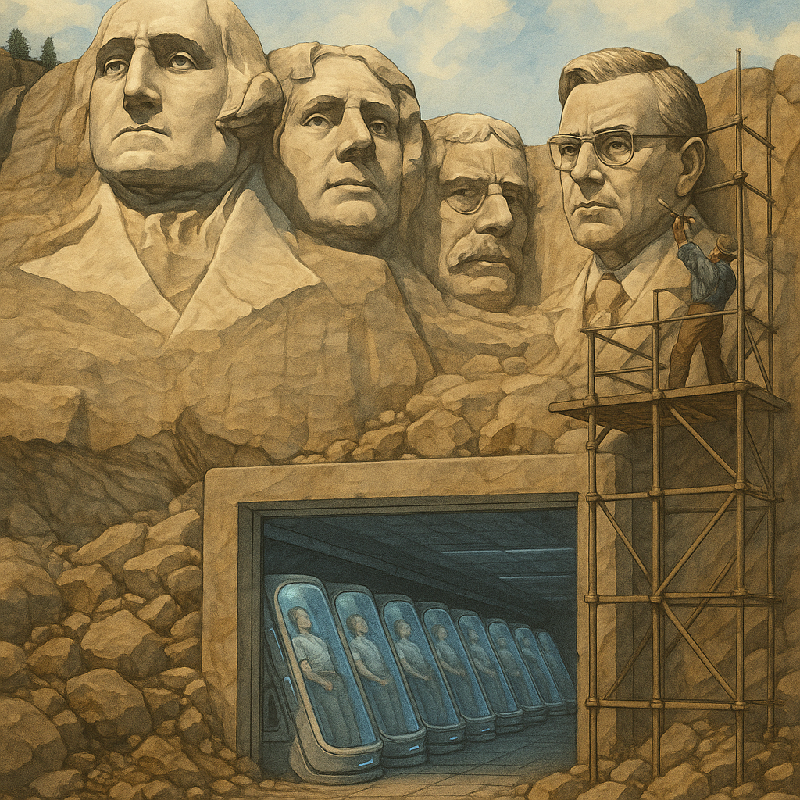
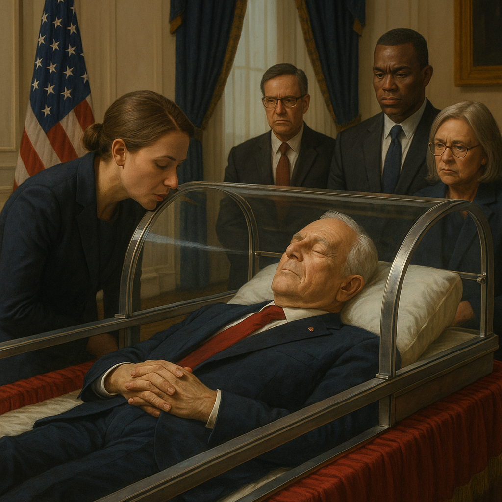

# The Sleeping Dictator

We, the people of the Reunited States, in order to forge a more perfect Union, to establish justice, to ensure domestic tranquility, to provide for the common defense, to promote the general welfare, and to secure the blessings of liberty to ourselves and our posterity, do hereby proclaim and establish this Constitution for the Reunited States of America.

*Article I. Section 1.*

This article of the Constitution is fundamental and shall not be amended.

*Article I. Section 2.*

Every citizen has the right to request cryosleep for a period of no more than twenty-five years. The Reunited States of America guarantee the suspension of all legal obligations and deadlines during the time of sleep. Upon awakening, a citizen’s biological age shall be restored to the moment of entering cryosleep. All legal obligations shall resume as though awakening had followed immediately after falling asleep.

...

*Article II. Section 1.*

Executive power shall rest with the President of the Reunited States of America, who shall serve a term of four years.

## Reunification

The Oval Office was crowded. For the first time in three years, it once again held authority over the whole of the United States. Only the fortified defenses around the White House hinted at the years of war: a few Patriot batteries stood on the lawn, left behind as scenery. The real battle watch was over.

The Second Constitutional Convention had done its work. The fighting was halted. People were back to their lives. A new agreement between the states had been drafted. Most astonishing of all, they had agreed to reunite, temporarily, until the treaty could be signed.

Joe’s presidency was drawing to a close. These had been the hardest, most tragic years of his life. He had inherited a country torn by contradictions, inequality, and crushing debt. There had been no time to heal it: the people were weary of hardship and rose in revolt. They turned against the banks that raised their interest, against the chains of student loans and mortgages.

The authorities could not stem the tide of violence. Bankers were beaten, offices destroyed, vaults looted, data centers burned in a desperate attempt to erase the national credit record. But the rage only deepened the ruin. Wealthier states declared independence, poorer ones refused to let them go — and war broke out.

The only way to stop it was to promise a just redistribution of the economic pie. But after years of turmoil, there was little left to share. Then President Joe Ford had a bold idea: if the pie could not yet be made larger, perhaps the number of those at the table could be made smaller.

Just before the war, scientists had achieved a miracle: the freezing and safe revival of human beings. Cryosleep worked as the old novelists had imagined. A man could sleep for decades, his body unchanged, his biological clock slowed to a near-standstill.

Yet by the outbreak of war, no more than a few hundred lay sleeping. The procedure was rare and ruinously expensive. They were mostly the wealthy, tired of wandering the stars and eager instead to leap into the future. Many had chosen to wake after a hundred years or more.

Ford resolved to offer cryosleep to everyone. At cost, the procedure was cheap, and under emergency law, the government could compel companies to provide it. The corporations themselves were faltering, unable to maintain even their existing cryobanks.

Polls showed that many would gladly go to sleep if given guarantees: that they would not wake crushed beneath overdue interest, but perhaps to find something saved. Rich states were willing to pay for poorer ones, if only to end the war. But the poor wanted promises in writing.

In truth, the United States no longer existed. Thirteen states had seceded, others defied Washington, issuing their own currencies in open violation of the old Constitution. The stars on the flag in Joe’s office still numbered fifty, but it was a fiction.

So President Ford gambled everything. He called for a new Constitutional Convention — not amendments, but a new foundation. Six months of pleading brought even the breakaway states to the table; six months more of wrangling produced a text.

It was not so different from the old. Yet in its very existence it admitted the truth: the republic born 243 years ago was gone, and something else had taken its place. The central change was simple, but profound: the right to cryosleep would be guaranteed to all. By the time the ink dried, 42% of the nation had already enrolled to sleep. When the Constitution was signed, the greatest mass freezing in history would begin.

Joe could scarcely believe it: he had stopped the madness. Soon he would sign the new Constitution — the last president of the United States, and the founding father of the Reunited States. He picked up his pen, silence fell, cameras clicked. And with that, the United States ceased to exist.

# The First Sleep and Awakening

Seven and a half years passed. Fifty-seven percent of the people slept. Many had chosen the full twenty-five years allowed. With fewer mouths to feed, power use plummeted. Robots spread, industry revived, and the economy surged, soaring beyond its old heights. Yet the debts of the sleepers still outweighed the gains. Optimists said: another decade, and they will wake debt-free, swelling the middle class.

Joe’s second term was ending. His popularity was boundless; people adored him. A petition awaited in Congress to carve his face into Mount Rushmore beside Washington, Jefferson, Roosevelt, and Lincoln. Joe had grown too used to glory to give it up. He mourned the ban on a third term. So many seeds he had planted would ripen later, harvested by another. It gnawed at him.

Then came the jest. In a podcast, he was asked to enter cryosleep until the end of his term — wake once a year, give orders, and return to sleep. The audience laughed. But the lawyers examined it seriously. By the Constitution, they said, his term would be extended by any time he spent in sleep.

So Ford resolved to try. With the best of intentions, he would stretch his remaining 172 days into a year, maybe more. The world record was three cryosleeps. That would do. He set his affairs in order, signed decrees, and entered the cryocenter.

Joe closed his eyes. Joe opened them. Outside, six months had passed; inside, not even a breath. He rose, returned to the White House, and resumed his workday — the same one, only half a year delayed.

The economy was booming. Other nations scrambled to follow, but their bureaucracies dragged. Only China’s Party had matched the feat, freezing 4.1 billion people — a third of the Earth! But the Reunited States had a great head start.

His awakening was celebrated like a holiday. Mount Rushmore itself had changed: his face now loomed from the granite. Yet Joe felt unease. If he followed the plan, he would wake only once more, finish his term, and hand glory to his successor — the one who would greet those who had slept through the storm. That could not be allowed. He was loved. The Constitution was on his side.

A week later, Joe returned to sleep.

# Sleepy Joe

He awoke. The people cheered, but less. The second awakening was news, but not a miracle. Life had gone on without him. Attention shifted to the vice president, Craig, who quietly managed affairs.

Craig was diligent, careful, modest. His job was only to see that the “Joe Plan” was obeyed. Yet people credited him with the successes. Commentators saw him as the next president.

Joe was shaken. Without cryosleep, his presidency would have ended already. Yet his term was extended, while Craig, by law, had overstayed his own. By one clause he could serve until Ford awoke; by another, his term was limited to four years.

The people still revered the Constitution that had brought peace. Joe seized the paradox. Craig was forced to resign. In his place came a weak but kindly man — no rival to Ford.

And then Joe remembered Moscow. The Mausoleum. Lenin lying, century after century, visitors whispering their secrets to him. What if Lenin had not been dead, but only asleep?

Within a week, the White House prepared a chamber of glass and steel. There the president would sleep, in full view of his ministers. Rumors would spread: he heard everything. Visitors would come, as they once came to Lenin — but this time to a living man. A president whom you could approach, whisper to, even while he slept.

Before drifting into darkness again, Joe smiled. His presidency might now last a century. Unless, of course, the people chose to wake democracy instead of him.

Evgenii Ivanov (eivanov89),
2025.