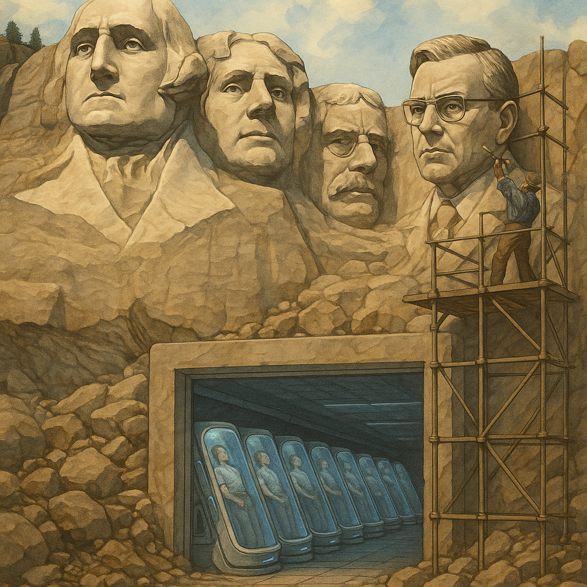
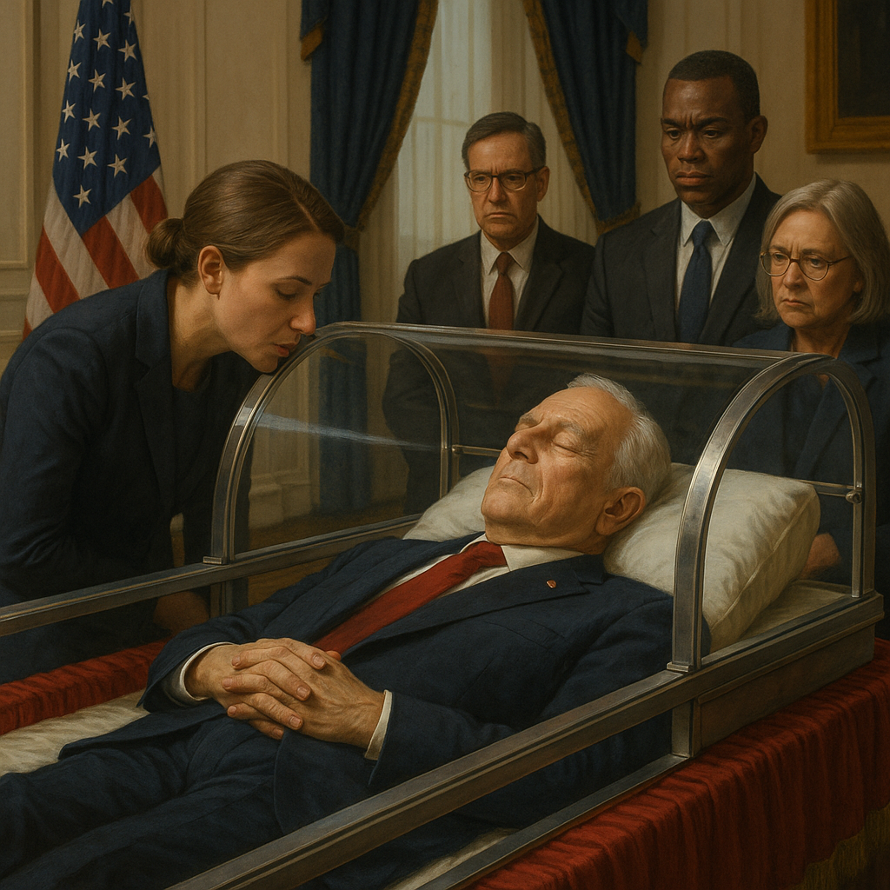

# Спящий диктатор

Мы, народ Воссоединённых Штатов, в целях образования более совершенного Союза, установления правосудия, обеспечения внутреннего спокойствия, организации совместной обороны, содействия всеобщему благосостоянию и обеспечения благ свободы для нас и нашего потомства, провозглашаем и устанавливаем настоящую Конституцию для Воссоединённых Штатов Америки.

*Статья 1. Раздел 1.*

Данная статья Конституции является основополагающей и не подлежит изменению.

*Статья 1. Раздел 2.*

Любой гражданин может затребовать криосон на период не более двадцати пяти лет. Воссоединённые Штаты Америки гарантируют приостановку всех юридических обязательств спящего и сроков их выполнения. После пробуждения гражданину присваивается биологический возраст, зафиксированный в момент начала криосна. Все юридические обязательства возобновляются в момент пробуждения без учёта времени сна, как если бы пробуждение следовало мгновенно за наступлением сна.

...

*Статья 2. Раздел 1.*

Исполнительная власть принадлежит Президенту Воссоединённых Штатов Америки. Он занимает свою должность в течение четырёх лет.

## Воссоединение

Овальный кабинет был полон. Впервые за три года офис снова обладал исполнительной властью над всей территорией Соединённых Штатов Америки. О трёх годах войны напоминала лишь усиленная охрана Белого дома: несколько батарей «Пэтриот» стояли на лужайке, но их оставили для антуража. Настоящее боевое дежурство уже закончилось.

Второй Конституционный конвент выполнил свою работу: боевые действия были остановлены, и люди вернулись к мирной жизни. Текст нового соглашения между всеми штатами был согласован. Что самое удивительное, они согласились объединиться временно обратно в США, пока новое соглашение не будет подписано.

Срок президентства Джо подходил к концу. Это были самые тяжёлые и трагичные годы в его жизни. Ему досталась страна, раздираемая на части противоречиями, социальным неравенством и непосильной долговой нагрузкой. У него просто не было времени что-то изменить: люди устали от тяжёлой жизни и восстали. Восстали против банков, постоянно повышающих проценты, студенческих кредитов, ипотечного рабства.

Власти были бессильны остановить волну массового насилия. Сначала досталось финансистам. Офисы были разгромлены, банки разграблены, дата-центры уничтожены в попытке обнулить общенациональную кредитную историю. Но это не решило проблем, а только усугубило их. Тогда богатые штаты объявили независимость, но бедные штаты их не отпустили, и началась война.

Остановить это можно было только пообещав справедливый передел экономического пирога. Но после нескольких лет смутного времени делить было особо нечего. В какой-то момент президенту Джо Форду пришла в голову оригинальная идея: раз пока нельзя нарастить пирог, чтобы все остались довольны, то надо временно уменьшить число тех, кто его делит.

Перед самой войной учёные и инженеры достигли прорыва в области заморозки и разморозки людей. Всё получилось, как предсказывали фантасты: человека отправляли в криосон, а размораживали через много лет без каких-либо последствий. При этом биологические часы так замедлялись, что практически не шли.

Однако к началу войны число находящихся в криосне не превышало пары сотен человек. Процедура была необычной и дорогой. Большей частью это были богачи, которые пресытились путешествиями в пространстве и решили совершить путешествие в будущее. У многих время пробуждения стояло через сто и более лет.

Президент Форд решил дать доступ к заморозке всем желающим. По себестоимости процедура была недорогой, а затянувшееся чрезвычайное положение позволяло правительству вынудить компании проводить её по той цене, по которой государство могло закупить массовую заморозку. Тем более что компании с началом смутного времени испытывали трудности и им было тяжело поддерживать в работоспособном состоянии хотя бы имеющиеся криобанки.

Опросы показывали, что достаточно много людей охотно согласятся на криосон, если у них будут значимые гарантии: когда они проснутся, их не задавят пени просроченных кредитов, а наоборот что-нибудь накопится. Богатые штаты были готовы оплатить бедным собратьям процедуру, лишь бы остановить войну. Но бедные хотели гарантий.

Фактически США больше не существовало. Номинально Джо всё ещё был президентом, на флаге в его кабинете по-прежнему было пятьдесят звёзд, да только 13 штатов объявили независимость, а среди оставшихся тяжело было добиться подчинения федеральным властям. Некоторые хоть и не отсоединились, но ввели свою валюту, что нарушало Конституцию и было равносильно объявлению отсоединения.

Президент Форд решился на отчаянный и рискованный шаг. Он предложил созвать второй Конституционный конвент и составить новую Конституцию, учитывающую современные реалии и возможности науки. Полгода ушло на то, чтобы уговорить все штаты, включая отсоединившиеся, прислать своих представителей. Ещё полгода — на согласование текста.

Новый текст мало отличался от старого. То, что это была не поправка, а новая Конституция, скорее стало признанием факта, что тех США, основанных 243 года назад, больше нет. И что на смену старому государству приходит новое. Ключевым отличием в тексте было то, что право на криосон гарантировалось всем желающим. К моменту окончательного согласования текста число записавшихся спать составляло 42% населения страны. Как только документ будет подписан, начнётся самая массовая заморозка людей в истории мира.

Джо не верилось, что ему удалось остановить безумие, и сейчас он подпишет новую Конституцию, после чего станет последним президентом США и одним из отцов-основателей ВША. Он взял ручку, в зале установилась тишина и раздались многочисленные щелчки затворов фотоаппаратов. США прекратили своё существование.

## Первый сон и пробуждение

Прошло семь с половиной лет. 57% населения страны спали. Многие указали пробуждение через 25 лет — максимально предусмотренный Конституцией срок. Уменьшение численности населения привело к значительному снижению электропотребления. Неожиданный прорыв в робототехнике и наличие большого количества электроэнергии привели к тому, что экономика не только восстановилась до докризисных показателей, но и перешла чуть ли не к экспоненциальному росту. Однако этого всё равно было мало, чтобы покрыть все долги спящих. Но прогнозы были хорошие: скорее всего, ещё лет десять — и люди будут просыпаться без долгов, пополняя ряды среднего класса.

У Джо заканчивался второй срок президентства. Его рейтинги били все рекорды, люди буквально ему поклонялись. К окончанию его срока Конгресс должен был рассмотреть петицию с предложением увековечить его лицо в Южной Дакоте в компании Вашингтона, Джефферсона, Рузвельта и Линкольна. Джо так привык к славе, власти и успеху, что очень жалел, что третий срок невозможен. Столько ростков ещё не дали плодов — соберёт их кто-то другой лет через пять–десять. Это терзало его душу.

Сегодня ему было особенно тяжело. Он поучаствовал в онлайн-шоу, где известные подкастеры выбирали случайные вопросы и предложения, а он должен был кратко и быстро отвечать. Кто-то из аудитории предложил ему лечь в криосон до окончания президентства, а потом просыпаться раз в год, проверять воплощение планов в жизнь, давать указания и снова засыпать. Это было высказано в шуточной форме, но уже через час все именитые юристы сошлись на том, что согласно Конституции ВША срок обязан быть продлён на время сна.

И президент Форд, исходя из лучших побуждений, решился продлить свою власть, используя криосон и растянуть оставшиеся 172 дня на год–полтора. Пока мировым рекордом было три криосна — этого ему хватит. За неделю он привёл дела в порядок, подписал сотню различных распоряжений и отправился в криоцентр.

Джо закрыл глаза. Джо открыл глаза. Вокруг него прошло полгода, внутри него — одно мгновение. Как только врачи закончили обследование, он отправился прямиком в Белый дом, чтобы продолжить рабочий день, начавшийся полгода назад и прерванный дневным сном.

Показатели экономики били все рекорды. Другие страны пытались перенять опыт ВША, но их бюрократические машины работали медленно. Только компартия Китая смогла быстро принять законы и построить сеть криоцентров, где уже находилось 4,1 млрд человек — треть населения всей Земли! Но у ВША была огромная фора.

Его пробуждение широко обсуждалось в прессе. Это стало практически общенациональным праздником. Во время его отсутствия памятник Маунт-Рашмор был обновлён: теперь и его лицо было увековечено в скале. Тем не менее Джо охватила тревога. Если следовать изначальному плану, то через полтора года он проснётся после последнего криосна, чтобы окончить свой срок и передать власть преемнику. Тот встретит тех, кто заснул в кризисные годы, и именно ему достанутся все лавры. Этого нельзя допустить. Он популярен, люди его любят, Конституция даёт ему такое право!

Через неделю президент Форд снова приехал в криоцентр, чтобы заснуть ещё на полгода.

## Соня Джо

Джо проснулся. Ему были рады, но уже не так. Второе пробуждение привлекло внимание прессы, но в этот раз ажиотажа не вызвало. Более того, он заметил, что пока он спит, политическая жизнь страны продолжается. Людям был нужен предмет для обсуждения, и всё внимание переключилось на вице-президента, который исполнял его обязанности.

Вице-президент Крейг хорошо делал свою работу. Тем более что надо было всего лишь неуклонно следить за выполнением указов, известных как План Джо. Проблема была в том, что люди стали считать достижения этих указов достижениями самого Крейга. Политические обозреватели прочили ему пост президента. До Джо лишь один человек в мире находился в криосне более двух раз, поэтому никто не ожидал, что Джо снова пойдёт на это.

Обязанностью Крейга было лишь выполнять указания, оставленные Фордом. Но людям был нужен кто-то, кого они регулярно видели в новостях, а не спящий в одном из криобанков президент. Некоторые стали даже называть Форда Спящим Джо или Соней Джо. Это не носило повсеместного характера, но Джо понимал: ему надо либо прекратить криосны и вскоре с большой вероятностью передать власть Крейгу, либо как-то иначе решить проблему.

Решение долго искать не пришлось. Если бы не криосон, президентство Форда закончилось бы ещё полгода назад. Однако Конституция была на его стороне, и срок был продлён. Вице-президент Крейг же занимал свою должность дольше, чем положено. С одной стороны, он мог её занимать, пока не закончится срок президента Форда. С другой стороны, Конституция строго ограничивала его время на посту четырьмя годами.

Люди ещё помнили трудные времена и чтили новую Конституцию, которая принесла им покой и новое экономическое чудо. Джо воспользовался этим и обратил юридический парадокс против Крейга, который был вынужден подать в отставку. Его место занял человек слабый, глупый, но милый — такой, который симпатичен людям, но никогда не составит конкуренцию Форду.

Ещё Джо вспомнил свои визиты в Москву. Там ему показали мавзолей, где уже больше ста лет покоится вождь пролетариата. Одно время у него было не так много посетителей, но после столетнего юбилея интерес к нему значительно вырос. Джо представил: а что было бы, если бы Ленин был жив и просто спал?

На подготовку к новому сну Джо потратил целую неделю. В экстренном порядке в Белом доме готовили специальную комнату, где в бронированной стеклянной капсуле будет спать президент ВША Форд. Все совещания кабинета министров будут проходить в этой комнате. Пресс-служба пустит слух, что Джо всё слышит, и так он будет в курсе всех дел, когда проснётся. Вне совещаний он будет доступен для посещений, как Ленин, но только живой. Люди, конечно же, захотят лично увидеть своего президента и шепнуть ему что-нибудь — никогда в истории такой возможности ещё не было.

Перед тем как снова заснуть, Джо подсчитал, что теперь его президентство может продлиться больше ста лет. Если только люди не захотят вернуть демократию и не перестанут его будить.

*Евгений Иванов (eivanov89),
2025.*